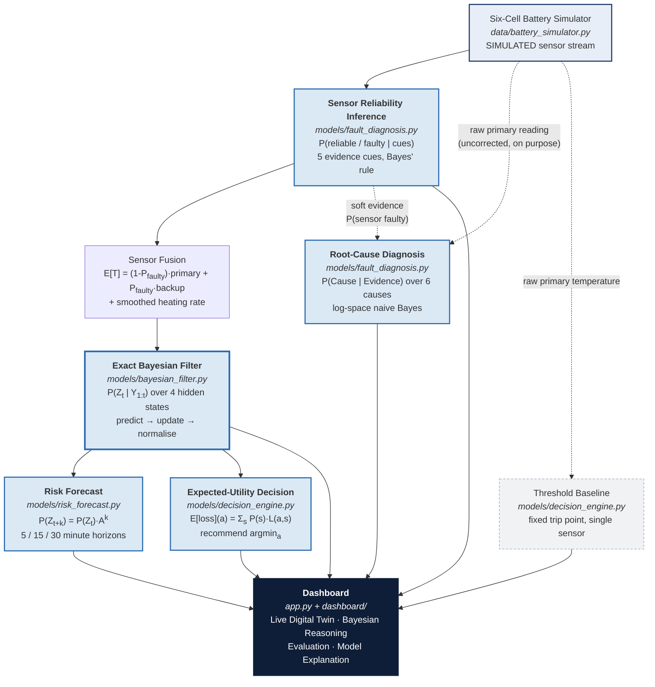
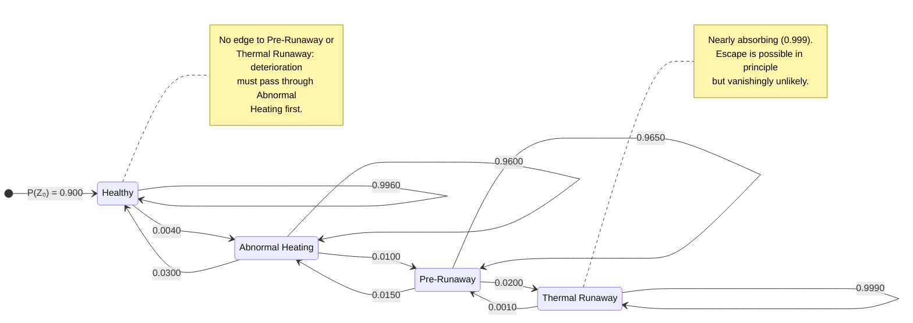

# CellSafe-X — System Architecture

> All data flowing through this architecture is **SIMULATED**. No real cell,
> sensor or vehicle is involved at any point.

---

## 1. End-to-end inference pipeline

### Why the ordering matters

**Reliability inference runs before the filter.** If a broken thermistor's
reading were fed straight into `P(Y | Z)`, a single failed sensor would drive
the hidden-state posterior to *Thermal Runaway* on its own, and the system would
shut down a perfectly healthy vehicle. Fusing first means the filter only ever
sees a temperature the system has a reason to trust.

**Root-cause diagnosis is given the RAW primary reading.** This looks
inconsistent with the paragraph above, and it is deliberate: a sensor fault can
only be *diagnosed* while its symptom — an implausibly hot reading — is still
visible. If the corrected temperature were used here, `Temperature Sensor Fault`
could never win, because the evidence for it would already have been erased.

---

## 2. Hidden-state transition model

Four latent thermal states with a first-order Markov transition structure.
Edge labels are the per-step probabilities from
`config/model_parameters.py :: TRANSITION_MATRIX`, where one step = 10 seconds
of simulated time.

**Properties encoded in the matrix**

| Property | How it appears |
|---|---|
| Persistence | Strong diagonal (0.96 – 0.999) — cells do not flicker between states |
| Gradual deterioration | Only forward edges to the *adjacent* worse state |
| Limited recovery | `Abnormal → Healthy` = 0.030; `Pre → Abnormal` = 0.015 |
| No teleporting failures | `Healthy → Pre` and `Healthy → Runaway` are exactly 0 |
| Nearly absorbing runaway | `Runaway → Runaway` = 0.999 |
| Valid stochastic matrix | Every row sums to exactly 1.000 (asserted at import time) |

---

## 3. Module map

| Layer | File | Responsibility |
|---|---|---|
| Parameters | `config/model_parameters.py` | Every prior, transition, Gaussian and loss value, in one place |
| Data | `data/battery_simulator.py` | Six-cell lumped thermal simulation, six scenarios, ground-truth labels |
| Inference | `models/bayesian_filter.py` | Exact forward filtering and k-step prediction |
| Inference | `models/fault_diagnosis.py` | Sensor reliability + root-cause posteriors |
| Inference | `models/risk_forecast.py` | Multi-step dangerous-state probabilities |
| Decision | `models/decision_engine.py` | Expected loss, action selection, threshold baseline |
| Orchestration | `models/__init__.py` | `CellPipeline` — wires the blocks together per cell, per step |
| Evaluation | `evaluation/evaluate.py` | Labelled sequences, metrics, figures |
| Presentation | `dashboard/`, `app.py` | Theme, components, four-tab Streamlit dashboard |
